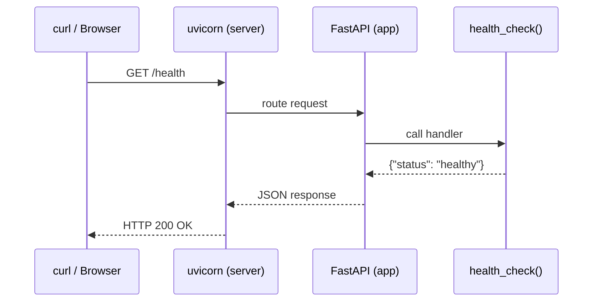
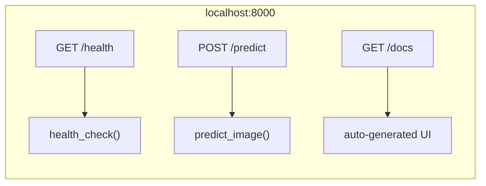
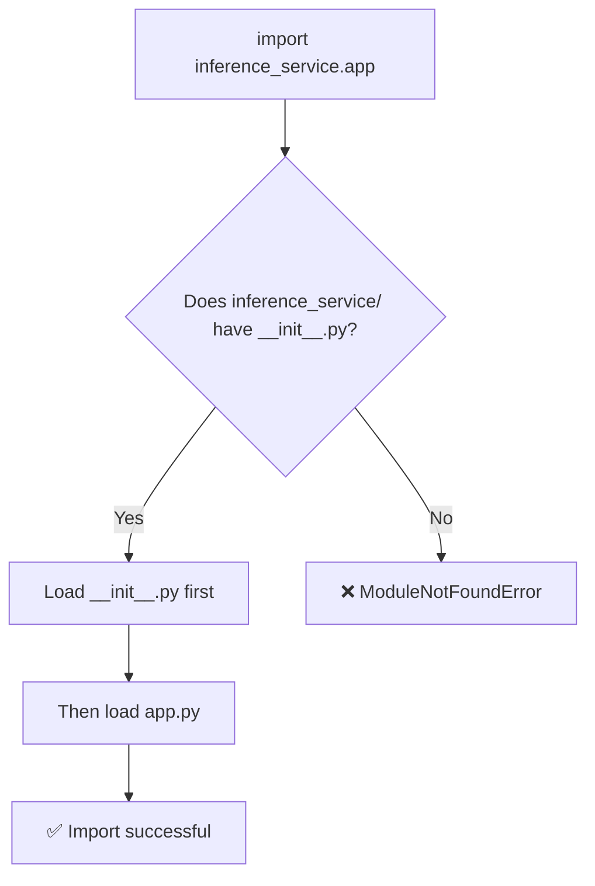

# A-1b: FastAPI Hello World — /health Endpoint

## What I did

- Created `inference_service/__init__.py` (makes the folder a Python package)
- Created `inference_service/app.py` with a FastAPI app and `/health` endpoint
- Ran the server with `uvicorn` and tested with `curl`

## Key Concepts

### What is an API?

**API** (Application Programming Interface) is a way for programs to talk to each other. In our case, it's a web API — you send an HTTP request to a URL, and get back a JSON response.

Think of it like a restaurant menu: the menu (API) lists what you can order (endpoints), you tell the waiter (HTTP request), and the kitchen sends back your food (response).

### What is FastAPI?

A Python framework for building web APIs. You write a normal Python function, add a decorator like `@app.get("/health")`, and FastAPI turns it into a web endpoint. It also auto-generates documentation at `/docs`.

### What is uvicorn?

The **web server** that actually listens for incoming requests and passes them to FastAPI. FastAPI defines *what* to do; uvicorn handles *how* to receive requests from the network.

Analogy: FastAPI = the chef (knows the recipes), uvicorn = the waiter (takes orders, delivers food).



### What is an endpoint?

A specific URL path that your API responds to. Like a door in a building — each door leads to a different room (function).

An endpoint = **HTTP method** + **URL path** → **function**



Think of it like a vending machine:
- The machine (server) sits at an address (`localhost:8000`)
- Each button (endpoint) gives you something different
- Button A1 (`/health`) → gives you status info
- Button B2 (`/predict`) → gives you a prediction result
- You also need to say *how* you're pressing (GET = "give me info", POST = "here's data, process it")

### What is `__init__.py`?

A special file that tells Python "this folder is a package you can import from." Without it, Python doesn't know if a folder is just a random directory or actual code. It's like a shop sign — without a sign, people don't know there's a shop inside.



Our `__init__.py` is empty — it just says "yes, this is a package" and nothing more. It *can* contain code (shared config, convenience imports), but doesn't have to.

This is why uvicorn can find `inference_service.app:app`. Without `__init__.py`, that path wouldn't resolve.

### What is an HTTP GET request?

The most basic type of web request — "give me this resource." When you type a URL in a browser or use `curl`, you're making a GET request. Other types exist (POST, PUT, DELETE) — we'll use POST later for `/predict`.

### What is JSON?

**JavaScript Object Notation** — a text format for structured data. Looks like Python dictionaries: `{"key": "value"}`. It's the standard language web APIs use to communicate.

## Commands Learned

| Command                                                | What it does                               |
| ------------------------------------------------------ | ------------------------------------------ |
| `uv run uvicorn inference_service.app:app --port 8000` | Start the FastAPI server on port 8000      |
| `curl -s http://localhost:8000/health`                 | Send a GET request to the /health endpoint |
| `python3 -m json.tool`                                 | Pretty-print JSON output                   |

### Breaking down `inference_service.app:app`

This tells uvicorn where to find the app:
- `inference_service.app` → the file `inference_service/app.py`
- `:app` → the variable named `app` inside that file

## Code Explained

```python
from fastapi import FastAPI          # Import the framework
app = FastAPI(title="Edge AI...")    # Create the app instance

@app.get("/health")                  # Decorator: "GET /health" → run this function
def health_check():                  # Just a normal Python function
    return {"status": "healthy"}     # Return dict → FastAPI converts to JSON
```

## Gotchas

- `__init__.py` is needed to make `inference_service/` a Python package — without it, `import inference_service` won't work
- uvicorn must be stopped (Ctrl+C) before you can start it again on the same port
- FastAPI gives you free API docs at `/docs` — very useful for testing

## Questions for Later

- What's the difference between GET and POST? (we'll use POST for `/predict`)
- What are HTTP status codes? (200 = OK, 404 = not found, etc.)
- How does FastAPI auto-generate the `/docs` page?
